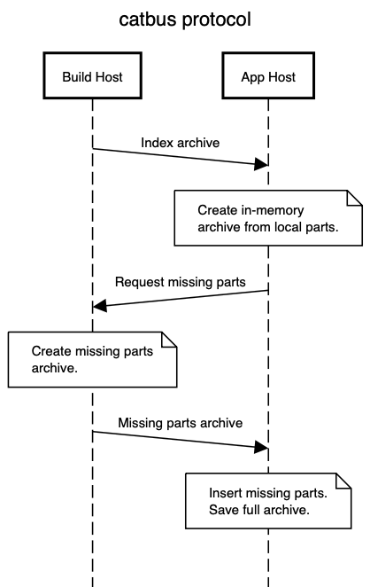

# catbus

Fast tarball transport. A content-aware transport for tar archives modelled on git `upload-pack` / `receive-pack`.


Save bytes and time when transferring a sequence of tar archives containing
largely the same content over time by sourcing already received parts from
a library-of-parts cache.

catbus allows you to slim down the bytes necessary to transport a given tar archive by
constructing an archive on the remote end from previously received tar archives.

## How it works



_Generated using https://sequencediagram.org/_

1. An index of the tar archive to be transport is precomputed and stored beside the tar archives using `catbus index`.
1. A receiver invokes `catbus transport receive-index` connected to a sender `catbus transport upload-index`. A reliable transport is assumed, such as SSH tunnels.
1. The sender writes the index to the receiver
1. The receiver tries to source the parts from the previously received local library of parts
1. The receiver requests missing parts from the sender
1. The sender generates an in-memory archive of the missing parts and sends it
1. The receiver inserts the missing parts and serialises the full archive

## How to build it

catbus is built using cargo and rust.

```
cd ~/catbus
cargo build
```

## When to use it

catbus may be useful when you have a library of archives like application builds that
you need to transport to a fleet of hosts in a network efficient manner. By pre-computing
the archives from local parts we trade CPU for network bandwidth.

A minimal set of parts is then transported to each host requesting the archive based on
the parts they need. A new host with no local parts will simply request the entire archive.

This is similar to how git negotiates the objects needed for a fetch but with a simpler
replacement for repacking the object database over time. Instead, old parts are pruned
when the transport cache is expired on a first in first out basis based on age.
